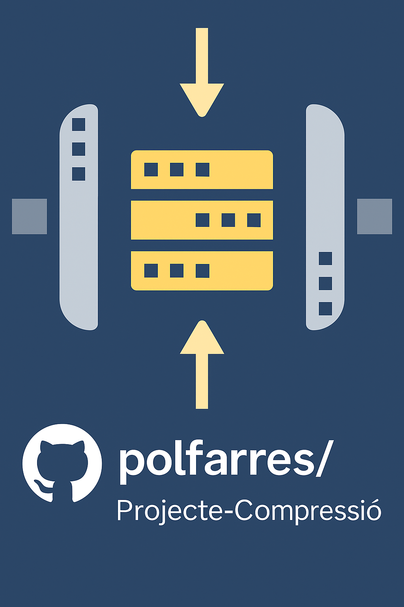

<!-- Improved compatibility of back to top link: See: https://github.com/othneildrew/Best-README-Template/pull/73 -->
<a id="readme-top"></a>

<!-- PROJECT SHIELDS -->
[![Contributors][contributors-shield]][contributors-url]
[![Forks][forks-shield]][forks-url]
[![Stargazers][stars-shield]][stars-url]
[![Issues][issues-shield]][issues-url]
[![project_license][license-shield]][license-url]
[![LinkedIn][linkedin-shield]][linkedin-url]

<!-- PROJECT LOGO -->
<br />
<div align="center">
  <a href="https://github.com/polfarres/Projecte-Compressi-">
    
  </a>

<h3 align="center">Projecte-Compressió</h3>

  <p align="center">
    Image compression project developed in Java.
    <br />
    <a href="https://github.com/polfarres/Projecte-Compressi-"><strong>Explore the docs »</strong></a>
    <br />
    <br />
    <a href="https://github.com/polfarres/Projecte-Compressi-">View Demo</a>
    &middot;
    <a href="https://github.com/polfarres/Projecte-Compressi-/issues/new?labels=bug&template=bug-report---.md">Report Bug</a>
    &middot;
    <a href="https://github.com/polfarres/Projecte-Compressi-/issues/new?labels=enhancement&template=feature-request---.md">Request Feature</a>
  </p>
</div>

---

## About The Project



This project implements a basic **image compression system** in Java.  
The goal is to analyze and apply **entropy coding**, **quantization**, and **prediction** — the first three main stages of an image compression pipeline.

This project has been developed as part of academic exercises on image compression and processing by both **Mikel Garzón Gomes** and **Pol Farres Ribatadalla**.

> **Note:** Entropy-related modules are still in progress.

<p align="right">(<a href="#readme-top">back to top</a>)</p>

---

### Built With

* [![Java][Java.js]][Java-url]

<p align="right">(<a href="#readme-top">back to top</a>)</p>

---

## Getting Started

You only need **Git** and **Java** — there are no external dependencies.

### Installation

1. Clone the repository  
   ```sh
   git clone https://github.com/polfarres/Projecte-Compressi-.git
    ```

2. Compile and run with Java

   ```sh
   javac Main.java
   java Main
   ```

<p align="right">(<a href="#readme-top">back to top</a>)</p>

---

## Usage

The program runs in the console and displays a menu like the following:

```java
System.out.println("Introdueix una opció (1-9 o 's'): ");
System.out.println("1.- Read Images");
System.out.println("2.- Calculate Total Entropy of Images (Order 0)");
System.out.println("3.- Conditional Entropy (Pixel Correlation)");
System.out.println("4.- Conditional Entropy of 4 Neighbor Pixels (Order 1)");
System.out.println("5.- Image Quantization");
System.out.println("6.- Image Dequantization");
System.out.println("7.- Image Prediction (after prior quantization)");
System.out.println("8.- Image Deprediction (Reconstruction)");
System.out.println("9.- Calculate Distortion Metrics (MSE and PAE) of Quantized Images");
System.out.println("-----------------------------------------------------------------------");
System.out.println("s.- Exit the Application");
```

<p align="right">(<a href="#readme-top">back to top</a>)</p>

---

## Roadmap

# Projecte-Compressió

Image Compression Project

* [x] Read and write images
* [x] Entropy calculation

    * [x] Entropy of order 0
    * [x] Entropies of order 1
* [x] Quantization
* [x] Dequantization
* [x] Entropy of the quantized image
* [x] Entropy of the dequantized (lossy) image
* [x] Prediction
* [x] Pipeline

We are currently focusing on the first **three stages** of image compression:
**Entropy**, **Quantization**, and **Prediction**.

See the [open issues](https://github.com/polfarres/Projecte-Compressi-/issues) for a full list of proposed features (and known issues).

<p align="right">(<a href="#readme-top">back to top</a>)</p>

---

## Contributing

Contributions are what make the open source community amazing.
Any suggestions or improvements are **greatly appreciated**.

1. Fork the Project
2. Create your Feature Branch (`git checkout -b feature/AmazingFeature`)
3. Commit your Changes (`git commit -m 'Add some AmazingFeature'`)
4. Push to the Branch (`git push origin feature/AmazingFeature`)
5. Open a Pull Request

<p align="right">(<a href="#readme-top">back to top</a>)</p>

### Top contributors:

<a href="https://github.com/polfarres/Projecte-Compressi-/graphs/contributors">
  
</a>

---

## License

Distributed under the project_license. See `LICENSE.txt` for more information.

<p align="right">(<a href="#readme-top">back to top</a>)</p>

---

## Contact

Pol Farres — [GitHub Profile](https://github.com/polfarres)

Project Link: [https://github.com/polfarres/Projecte-Compressi-](https://github.com/polfarres/Projecte-Compressi-)

<p align="right">(<a href="#readme-top">back to top</a>)</p>

---

## Acknowledgments

* Image processing and entropy theory resources
* Quantization and prediction algorithms references
* Java-based academic compression exercises

<p align="right">(<a href="#readme-top">back to top</a>)</p>

---

<!-- MARKDOWN LINKS & IMAGES -->

[contributors-shield]: https://img.shields.io/github/contributors/polfarres/Projecte-Compressi-.svg?style=for-the-badge
[contributors-url]: https://github.com/polfarres/Projecte-Compressi-/graphs/contributors
[forks-shield]: https://img.shields.io/github/forks/polfarres/Projecte-Compressi-.svg?style=for-the-badge
[forks-url]: https://github.com/polfarres/Projecte-Compressi-/network/members
[stars-shield]: https://img.shields.io/github/stars/polfarres/Projecte-Compressi-.svg?style=for-the-badge
[stars-url]: https://github.com/polfarres/Projecte-Compressi-/stargazers
[issues-shield]: https://img.shields.io/github/issues/polfarres/Projecte-Compressi-.svg?style=for-the-badge
[issues-url]: https://github.com/polfarres/Projecte-Compressi-/issues
[license-shield]: https://img.shields.io/github/license/polfarres/Projecte-Compressi-.svg?style=for-the-badge
[license-url]: https://github.com/polfarres/Projecte-Compressi-/blob/master/LICENSE.txt
[linkedin-shield]: https://img.shields.io/badge/-LinkedIn-black.svg?style=for-the-badge&logo=linkedin&colorB=555
[linkedin-url]: https://linkedin.com/in/linkedin_username
[Java.js]: https://img.shields.io/badge/Java-007396?style=for-the-badge&logo=openjdk&logoColor=white
[Java-url]: https://www.java.com/


